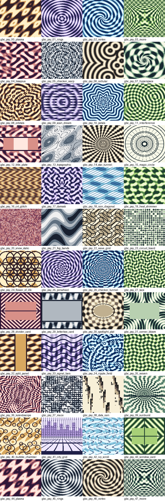

# Psychedelic Background Generator

Math-based background generator for Game Boy and Game Boy Color style images. It writes 160x144 PNGs, contact sheets, a browsable gallery, tile-count audit data, palette experiments, seed picks, and simple animation frame sets.



## Requirements

- Python 3
- Pillow

Install the Python dependency with:

```sh
python3 -m pip install Pillow
```

## Quick Start

Generate the default GB and GBC sets:

```sh
python3 generate.py
```

Open `generated/gallery.html` in a browser to filter and inspect the generated backgrounds.

## Useful Commands

```sh
python3 generate.py --count 32
python3 generate.py --seed 2026
python3 generate.py --modes gb
python3 generate.py --modes gbc
python3 generate.py --families scene_cards
python3 generate.py --families op_art glitch
python3 generate.py --render-styles low_tile
python3 generate.py --gbc-palette-mode bands
python3 generate.py --gbc-palette-mode tile
python3 generate.py --explore-seeds 64 --explore-best 24
python3 generate.py --animation-count 8 --animation-frames 4
python3 generate.py --palette-lab-count 16
python3 generate.py --output-dir /private/tmp/psy-bg
```

The default GBC palette mode is `image`, which keeps one 4-color palette across the whole image. Use `bands` for broad regional palette changes, or `tile` for louder per-tile color variation.

Each run clears old `*_psy_*.png` files for the selected mode before writing the new set.

## Generated Files

- `generated/gb/`: global 4-color grayscale PNGs.
- `generated/gbc/`: indexed-color PNGs using up to eight 4-color palettes, with every 8x8 tile constrained to one palette.
- `generated/gb_low_tile/`: low unique-tile grayscale PNGs.
- `generated/gbc_low_tile/`: low unique-tile GBC PNGs.
- `generated/animations/`: compatible frame sets and strip previews.
- `generated/gallery.html`: filterable browser for generated backgrounds.
- `generated/palette_lab.png`: palette comparison sheet.
- `generated/seed_explorer/`: automatically selected seed variants.
- `generated/manifest.json`: validation data and tile-count audit for every generated image.
- `generated/*_contact_sheet.png`: quick visual browsing sheets.

## Pattern Families

- `all`: every pattern family.
- `op_art`: high-contrast math and optical patterns.
- `scene_cards` / `text_safe`: plates with calmer center areas for text or no-HUD scenes.
- `glitch`: CRT, scan, static, and signal patterns.
- `maps`: contour, circuit, cellular, and sigil-like patterns.
- `weather`: rain, fog, heat shimmer, and static.
- `ornamental`: lace, damask, woven, and geometric motifs.

## Render Styles

- `full`: dense math backgrounds with maximum detail.
- `low_tile`: motif-based backgrounds intended to stay practical for GB Studio tile budgets.

## Compatibility Checks

The generator enforces these rules:

- Output dimensions default to `160x144`.
- Width and height must be divisible by `8`.
- GB images use 4 colors total.
- GBC images use no more than 4 colors per 8x8 tile.
- GBC tiles are assigned one of eight 4-color palette groups, based on the selected palette mode.
- Every image records total tiles, unique tiles, duplicate tiles, and whether it exceeds the soft tile budget.

The soft tile budget defaults to `192`, which is intended as a practical warning for GB Studio background use. It does not fail generation unless `--fail-on-tile-budget` is passed.

## Extras

- `gallery.html` reads `manifest.json` and supports filters for mode, render style, family, text-safe status, and tile budget.
- `palette_lab.png` shows selected patterns through each GBC palette without changing the source math.
- `seed_explorer/` generates many candidates, scores them for contrast, balance, and tile count, then saves the best picks.
- `animations/` writes compatible frame PNGs plus horizontal strip previews for quick browsing.

## License

MIT. You can use, modify, publish, and distribute the generator and generated assets, including commercially. Keep the copyright and license notice with copies or substantial portions of the work.
